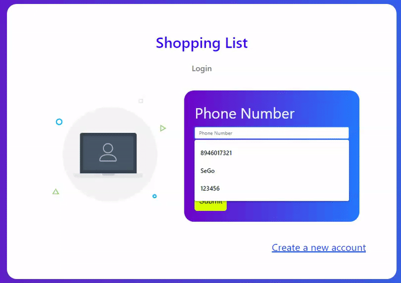
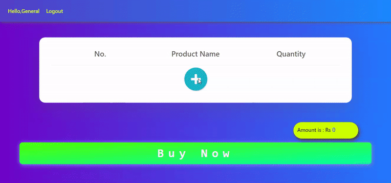

# DBMS PROJECT

This project is a website that allows a user to login and buy various products available in the database and produces an invoice.

The user is required to create an account first before using the app

***
Project by ***Gokul Raam*** and ***Serjeel Ranjan***
***
# Heroku Link-> [CLICK HERE TO USE THE APP](http://sego-shopping.herokuapp.com)

Use the following sample credentials to use the app:-

## Phone Number : 123456
## Password : abcde

***

## Tech stack used:
* HTML
* CSS
* Javascript (Vanilla JS and a pinch of jQuery)
* Django
* PostgreSQL

# 
SeGo Online Supermarket

The app is created from the user’s perspective where the users can browse through the stocks available in the store and order them.

### Using our App

1. First you have to login. You can either choose to create an account or use the sample credentials given above :point_up_2:

2. Then you can search for for required item and them to your list

3. Click on buy now and invoice will be generated.

# 
__Thank You__

